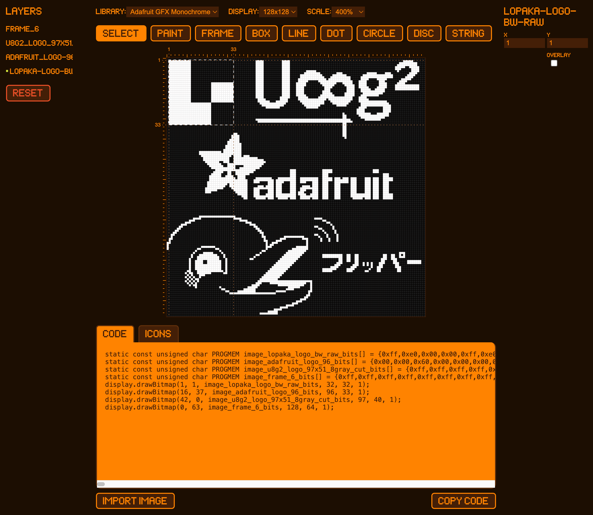

# Lopaka — Stunning graphics for embedded screens

Lopaka is an open-source graphics editor aimed at providing an interface for creating graphics for [TFT_eSPI](https://github.com/Bodmer/TFT_eSPI), [U8g2](https://github.com/olikraus/u8g2), [AdafruitGFX](https://github.com/adafruit/Adafruit-GFX-Library) and [Flipper Zero](https://flipperzero.one/). Compatible with [M5GFX](https://github.com/m5stack/M5GFX), [LovyanGFX](https://github.com/lovyan03/LovyanGFX), [Watchy](https://github.com/sqfmi/Watchy) and many others.

Draw any graphics and use generated code in your Arduino, ESP32 or STM32project!



## Table of Contents

- [Features](#features)
- [Installation](#installation)
- [Credits](#credits)
- [How to Contribute](#how-can-you-help)

## Features

[Release notes](https://github.com/sbrin/lopaka/releases)

[Keyboard shortcuts](https://github.com/sbrin/lopaka/wiki/Keyboard-shortcuts)

* pixel perfect editor
* various screen sizes
* many draw shapes and tools
* popular fonts support
* use custom images
* auto-generate XBMP graphics
* move, resize, edit elements
* generate the source code in C/C++
* FlipperZero live preview
* select zoom scale

## Supported platforms
* TFT_eSPI
* u8g2
* AdafruitGFX
* ESPHome (coming soon)
* FlipperZero
* Inkplate, Watchy


## Cloud App (no registation required)

We have a fork of this project deployed to CloudFlare pages:

[https://lopaka.app](https://lopaka.app)


## Installation

Lopaka is made with VueJS 3 and Vite build tool.

### Using docker-compose

```
docker-compose up --build
```

### Using pnpm (install pnpm first)

```
pnpm install
```

#### Development server
```
pnpm dev
```

#### Production build

```
pnpm build
```

## Credits

Thanks to all the contributions from the community. Special thanks go out to:

- [deadlink](https://github.com/deadlink)
- [sbrin](https://github.com/sbrin)
- [gaai](https://github.com/Gaai)
- [alploskov](https://github.com/alploskov)
- [bjornd](https://github.com/bjornd)

And many others who've contributed in various ways.

For a full list of contributors, see the [contributors graph](https://github.com/sbrin/lopaka/graphs/contributors).


## How can you help

Users feedback is the most precious thing for us. Feel free to start a [Discussion](https://github.com/sbrin/lopaka/discussions), [submit an Issue](https://github.com/sbrin/lopaka/issues), or fill in the [Feedback form](https://airtable.com/apps27BkejrUF0DWT/shryaJaGovGUA03XA).

**Like, share and subscribe is the easiest way to endorse this project.**

Follow us on [Twitter](https://twitter.com/lopaka_app) and [Instagram](https://www.instagram.com/lopaka_app/). Join our community in [Discord](https://discord.com/invite/7NhZG9AANb).

If you're embedded engineer or GUI designer or just a person who loves to make Arduino projects — [send me an email](mailto:feedback@lopaka.app) and share all your thougts. I need to know what my audience pain points are to make Lopaka better.

## We are looking for a sponsor

See [GitHub sponsorship options](https://github.com/sponsors/sbrin) ❤️

Feel free to contact us [info@lopaka.app](mailto:info@lopaka.app) ❤️
